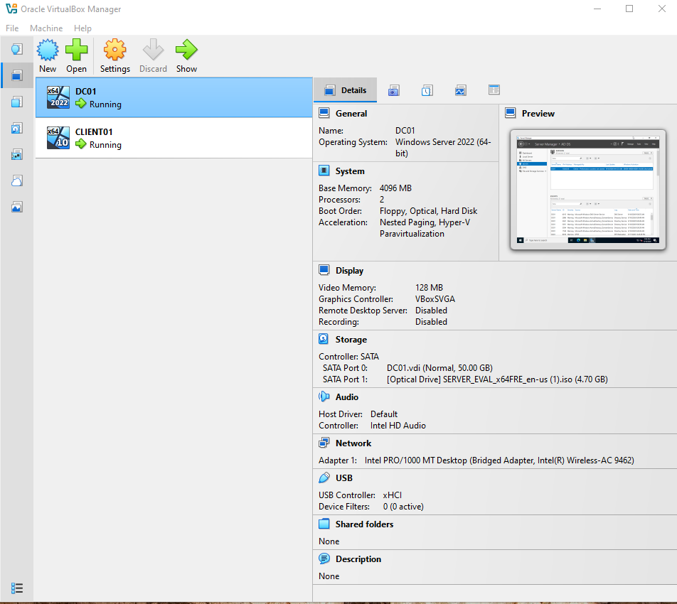
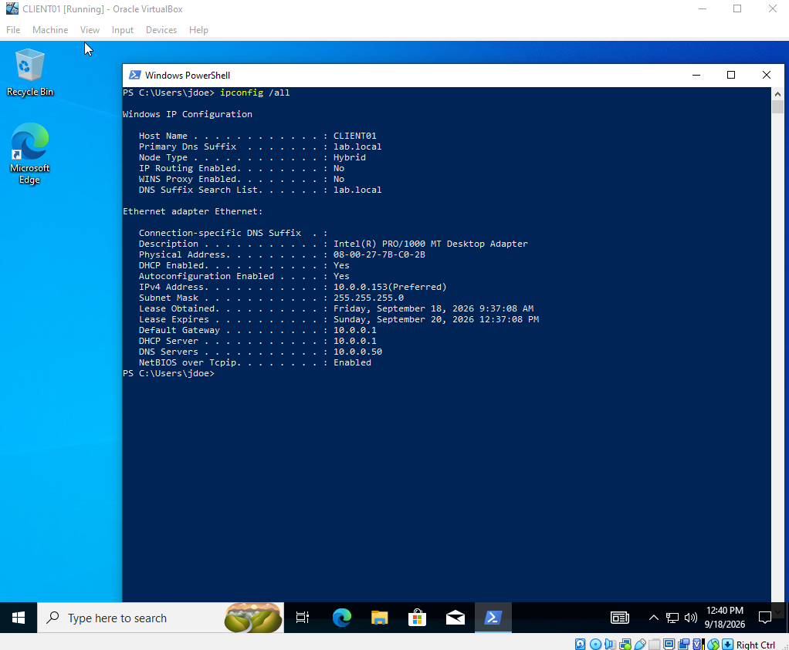
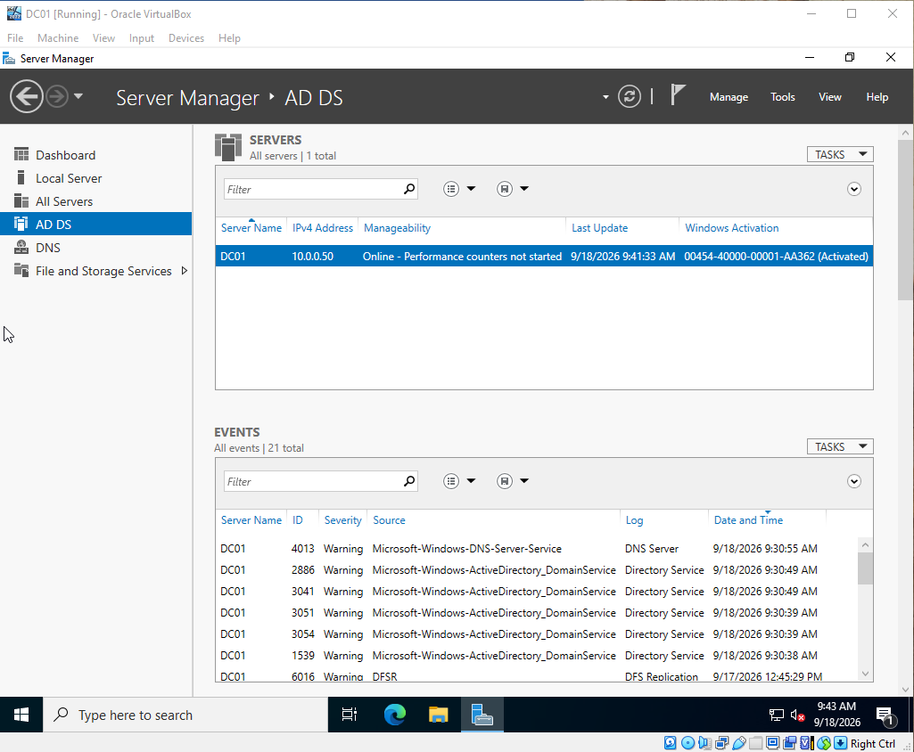
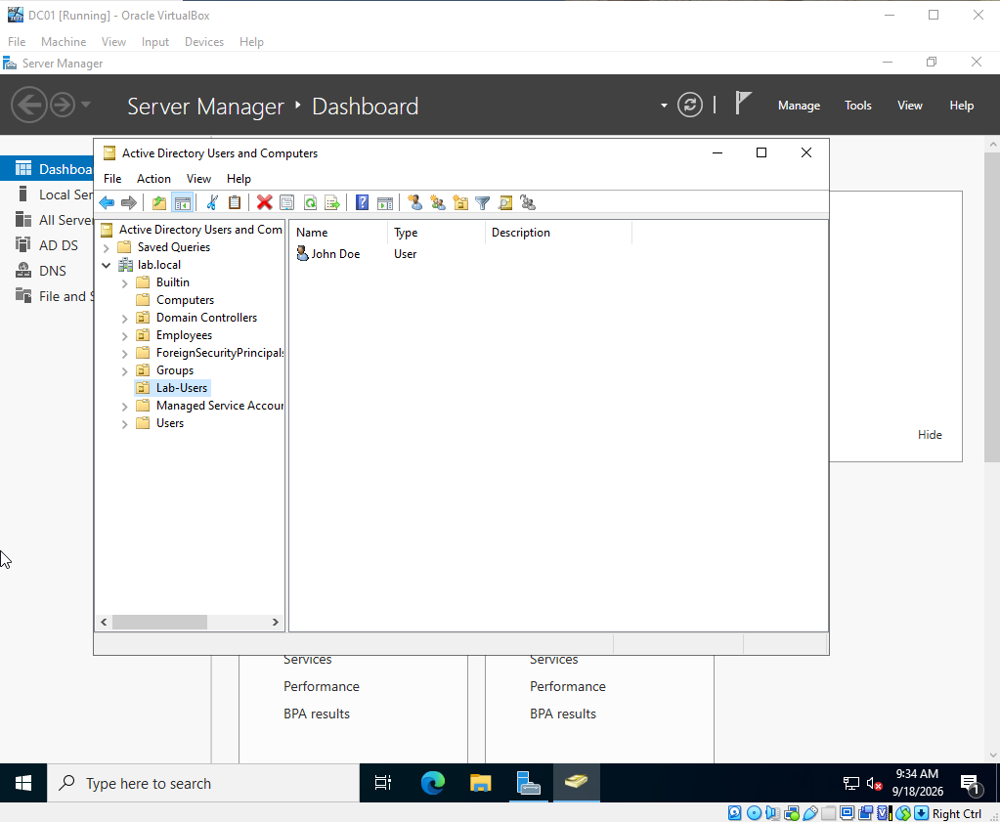
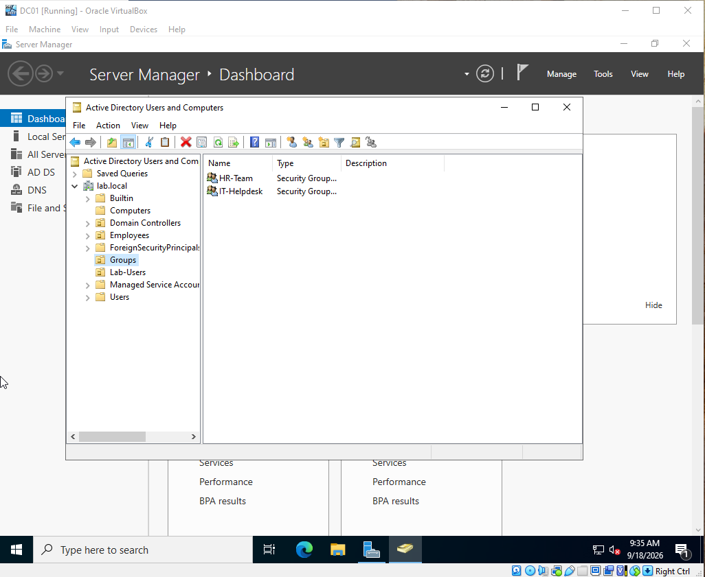
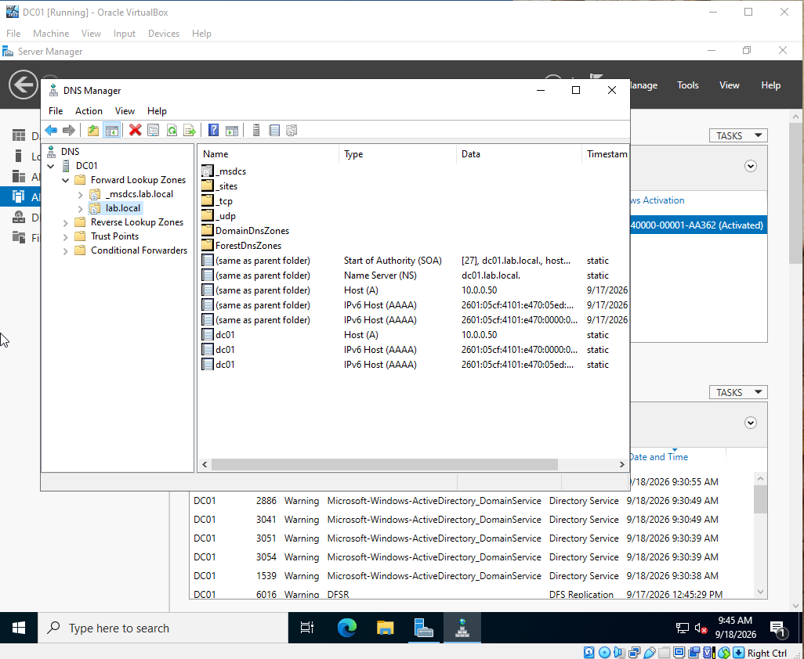
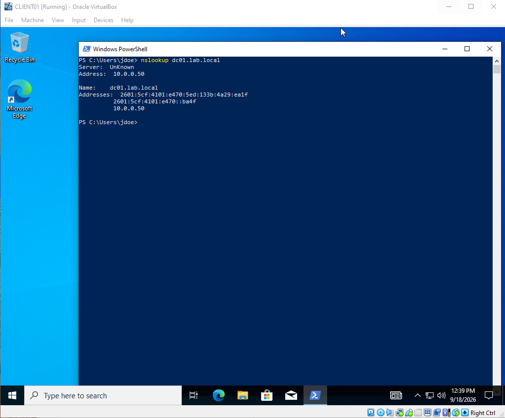
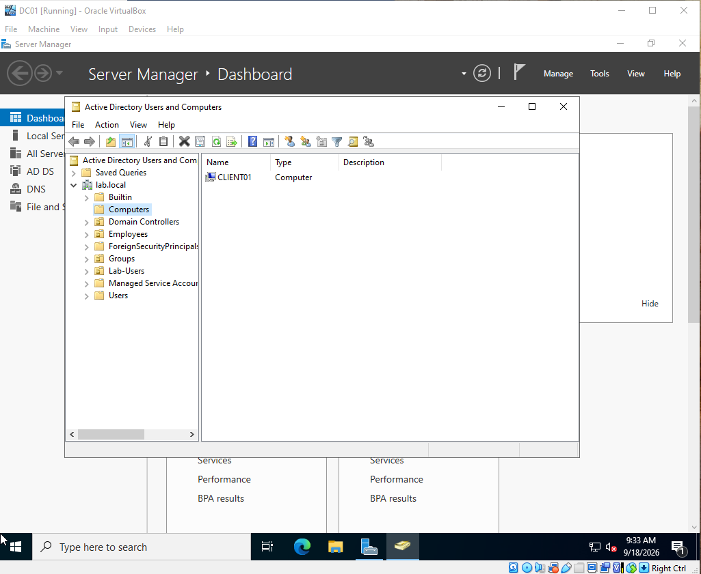
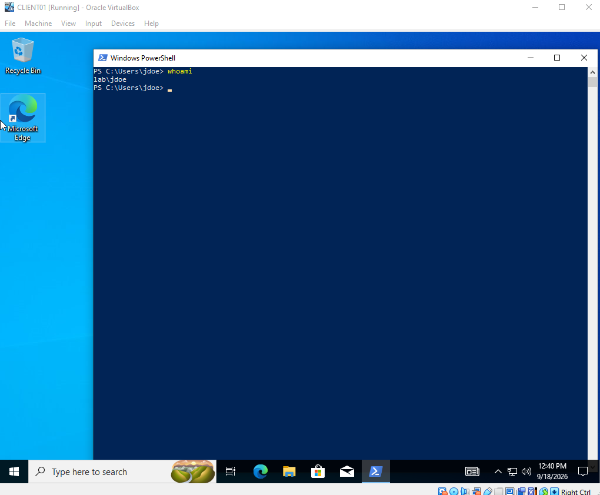
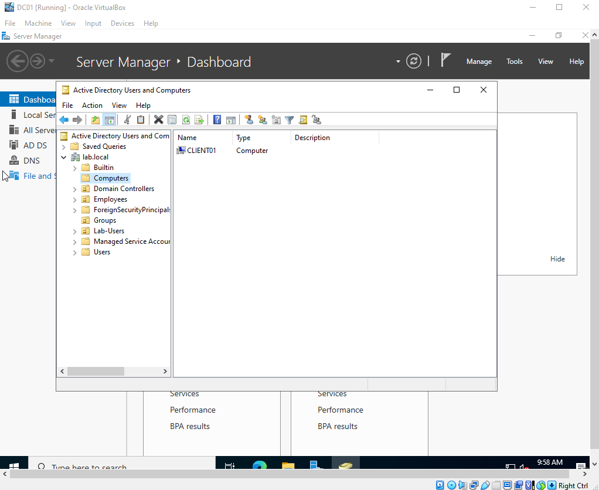

# Active Directory Home Lab

## Overview

This project is a virtual Active Directory environment built to simulate how an organization can centrally manage users, groups, computers, and authentication.

I created a Windows Server 2022 domain controller and a Windows 10 client using Oracle VirtualBox. I configured Active Directory Domain Services (AD DS), DNS, organizational units, users, and security groups before connecting the Windows 10 client to the domain.

## Lab Environment

Windows Server 2022: Domain Controller
Windows 10 Pro: Client Machine
Oracle VirtualBox: Virtualization
Active Directory Domain Services (AD DS)
DNS
Domain: `lab.local`
Domain Controller: `DC01`
Client Computer: `CLIENT01`

## Lab Architecture

The lab consists of two virtual machines running within Oracle VirtualBox:

### DC01: Domain Controller
Operating System: Windows Server 2022
Active Directory Domain Services installed
Promoted to a domain controller for `lab.local`
DNS configured for domain name resolution
Used to centrally manage domain users, groups, and computers

### CLIENT01: Domain Client
Operating System: Windows 10 Pro
Configured to use the domain controller for DNS
Joined to the `lab.local` domain
Successfully authenticated using a domain user account

### Network Configuration

Both virtual machines were configured so that the Windows 10 client could communicate with the domain controller. `CLIENT01` used `DC01` as its DNS server, allowing it to locate the `lab.local` domain and its domain controller.

## Active Directory Configuration

### 1. Domain Setup
Installed Active Directory Domain Services (AD DS) on Windows Server 2022 and promoted `DC01` to a domain controller for the new `lab.local` forest.

### 2. Organizational Units
Created organizational units (OUs) to organize and manage Active Directory objects, including:
`Lab-Users` for domain user accounts
`Groups` for security groups

### 3. User Management
Created a domain user account and placed it within the appropriate organizational unit. This demonstrated how administrators can centrally create and manage employee accounts.

### 4. Security Groups
Created security groups including:
`IT-Helpdesk`
`HR-Team`
This demonstrated how Active Directory groups can be used to organize users for centralized access and permission management.

### 5. DNS Configuration
Configured the Windows 10 client to use the domain controller as its DNS server. Verified DNS resolution by successfully resolving `dc01.lab.local` from `CLIENT01`.

### 6. Domain Join
Renamed the Windows 10 client to `CLIENT01` and successfully joined it to the `lab.local` domain using domain administrator credentials.

### 7. Domain Authentication
Verified the domain configuration by signing into `CLIENT01` with a `LAB` domain user account. This confirmed that the client could communicate with the domain controller and authenticate users through Active Directory.

### 8. Computer Management
Verified that `CLIENT01` appeared as a computer object in Active Directory Users and Computers on `DC01`, confirming that the workstation was successfully registered with the domain.

## Skills Demonstrated

Active Directory Domain Services (AD DS)
Windows Server 2022 administration
Active Directory user and group management
Organizational Unit (OU) management
DNS configuration and troubleshooting
Windows domain joining
Domain-based user authentication
Windows 10 client administration
Virtual machine configuration with Oracle VirtualBox
Basic network troubleshooting with `ipconfig` and `nslookup`

## What I Learned

This project gave me hands-on experience with how Active Directory is used to centrally manage users and computers within a Windows domain environment. I learned how a domain controller, DNS, user accounts, security groups, and client computers work together rather than configuring each component individually.

One of the most important parts of the project was understanding the relationship between DNS and Active Directory. During configuration, `CLIENT01` initially could not resolve the domain controller because it was using the wrong DNS server. After configuring the client to use `DC01` for DNS, I verified name resolution with `nslookup` and successfully connected the client to the domain.

I also gained experience troubleshooting domain authentication and learned how domain credentials differ from local Windows accounts. By the end of the lab, I was able to authenticate a domain user on `CLIENT01` and verify the computer from Active Directory Users and Computers on `DC01`.
